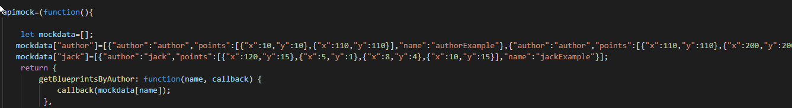
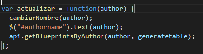
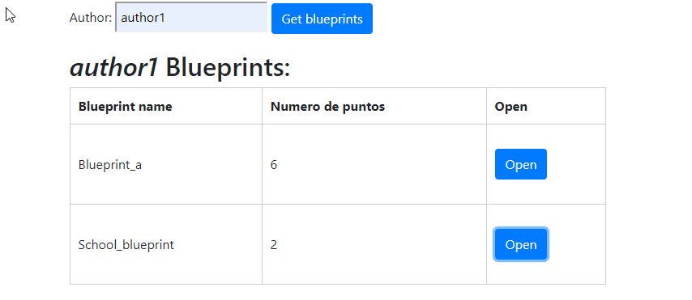

# Lab05-ARSW

# Compile and run instructions

Para ejecutar el proyecto se debe realizar el sigueinte comando

* gradle bootRun

Se debe tener gradle para poder realizar su ejecucion

# Frontend Views

se creo la pagina index.html en base a lo propuesto en el laboratorio

se puede ver en el explorador de la siguiente forma: 

# Frontend Logic

Con el fin de poder ver la funcionalidad de los scripts sin utlizar el back end de la aplicacion se debe realizar el sigueinte archivo:

Ademas la accion que realiza el boton se da gracias a la siguiente funcion

y se puede ver en el explorador de la sguiente manera:

# Next Week

