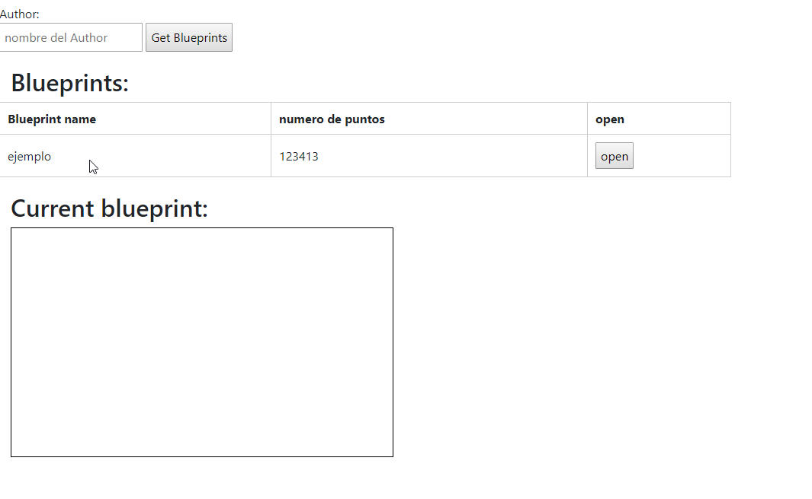
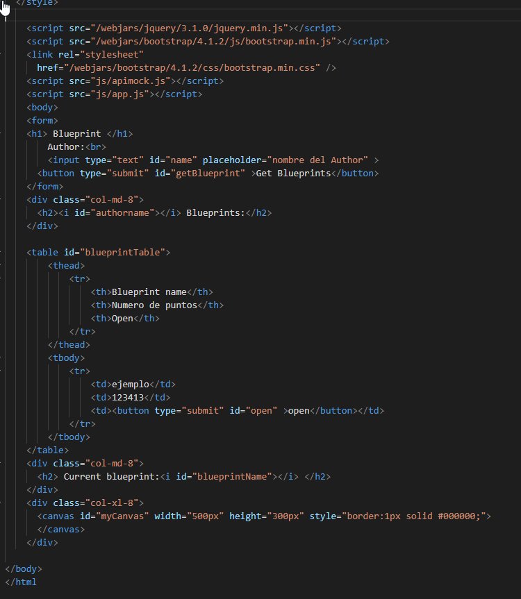

# Lab05-ARSW

# Compile and run instructions

Para ejecutar el proyecto se debe realizar el sigueinte comando

* gradle bootRun

Se debe tener gradle para poder realizar su ejecucion

# Frontend Views

se creo la pagina index.html en base alo propuesto en el laboratorio

se puede ver en el explorador de la siguiente forma: 

# Frontend Logic

--

# Next Week

